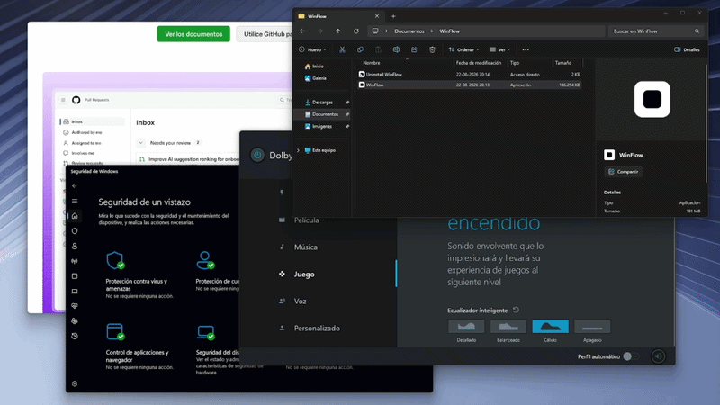
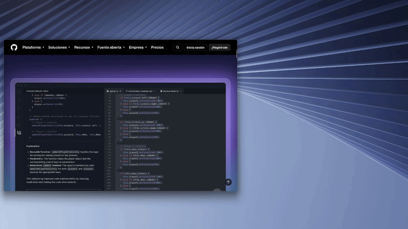
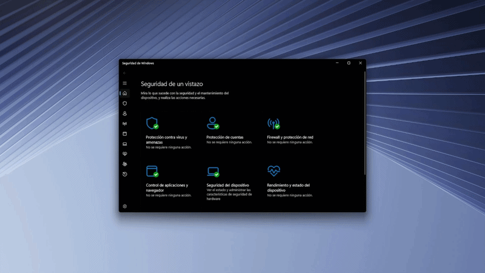

# WinFlow

**Controla tus ventanas de forma rápida y simple.**

Una utilidad ligera para Windows que funciona en segundo plano y permite controlar la ventana activa con atajos globales.

---

## Atajos

### Alt + C — Centrar

Presiona **Alt + C** para centrar la ventana activa en el área de trabajo del monitor donde se encuentra.

### Alt + V — Maximizar / restaurar

Presiona **Alt + V** para maximizar la ventana activa.

Si la ventana ya está maximizada, presiona **Alt + V** nuevamente para restaurarla y centrarla automáticamente.

---

## Bandeja del sistema

WinFlow funciona en segundo plano y muestra un icono en la bandeja del sistema.

Haz **clic derecho** sobre el icono para abrir el menú de WinFlow. Desde ahí puedes consultar los atajos disponibles o cerrar la aplicación.

## Instalación

WinFlow está disponible en Microsoft Store:

También puedes ejecutar `WinFlow.exe` para usar la instalación independiente.

WinFlow se instala automáticamente en `%LocalAppData%\Programs\WinFlow` y queda configurado para **iniciarse junto con Windows**.

Durante la instalación se muestra el progreso. Una vez terminada, el archivo original queda libre para que puedas eliminarlo de Descargas si quieres.

## Desinstalación

WinFlow se registra en Windows para poder desinstalarse normalmente.

Al desinstalarlo se eliminan la aplicación, sus accesos y la carpeta de instalación.

## Requisitos

- Windows 10 o Windows 11 de 64 bits.

## Comportamiento

WinFlow utiliza APIs estándar de Windows para centrar, restaurar y maximizar ventanas.

No modifica archivos del sistema ni la configuración de tus monitores. Las ventanas que no puedan ser controladas se ignoran. Si un atajo ya está registrado por otra aplicación, WinFlow continúa funcionando con los atajos que sí estén disponibles.

## Limitaciones

- Algunas aplicaciones o ventanas protegidas pueden impedir que herramientas externas cambien su posición o estado.
- Microsoft Smart App Control puede bloquear la versión independiente de WinFlow o mostrar una advertencia indicando que no se puede verificar el editor. Para una instalación distribuida directamente por Microsoft, puedes usar la versión disponible en **Microsoft Store**.
